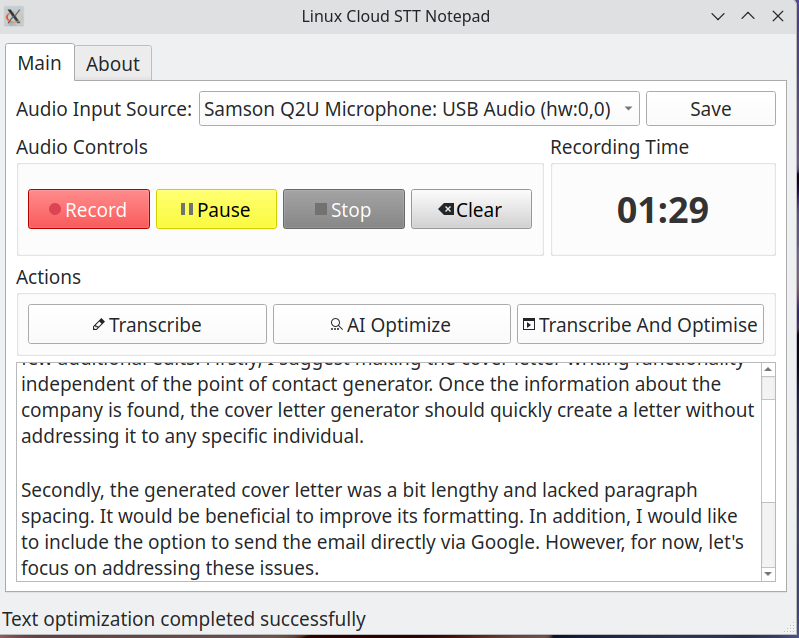
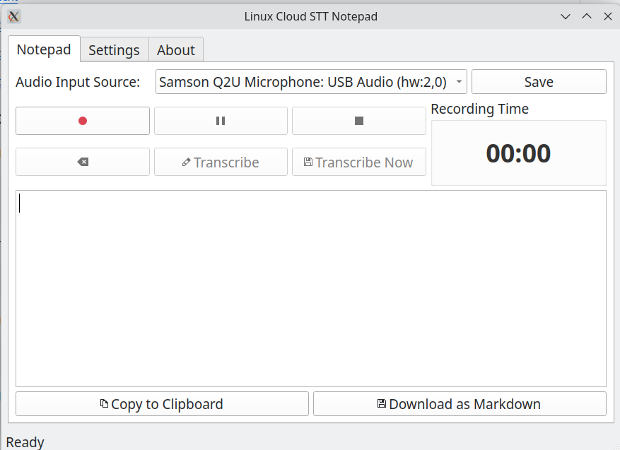
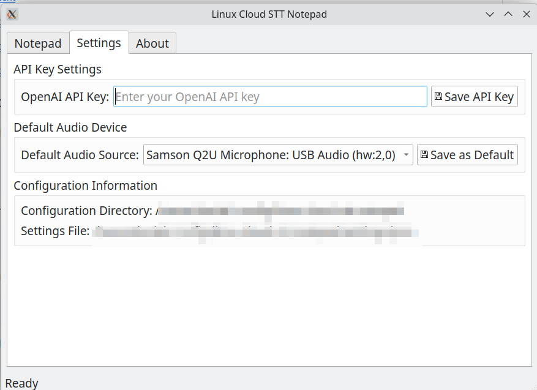

# Speech To Text Notepad With AI Text Optimisation 

 

 This project offers a desktop note-taking utility for the Linux desktop that utilizes OpenAI Whisper through its cloud API to accurately transcribe text. 
 
 An AI optimization feature sends the transcribed text for light editing via OpenAI LLM, preserving the meaning while organizing it for clarity. 

I developed this application because although I discovered some interesting note-taking applications for Linux, I couldn't find any that utilized speech-to-text via APIs instead of locally deployed models. I have had much better success with APIs and find the associated fees to be reasonable. 

This application will be periodically updated as I use it for my personal needs.

## Features

- Record audio from any input device
- Transcribe speech to text using OpenAI's Whisper model
- Edit transcribed text
- Copy text to clipboard
- Save transcriptions as Markdown files
- Persistent settings between sessions
- System tray integration for background operation

## Requirements

- Python 3.6+
- PyQt5
- sounddevice
- numpy
- scipy
- requests
- python-dotenv
- openai

## Screenshots

 ### Main UI

 

 ---

 ### Settings & API Key Configuration

 

## Installation

1. Clone this repository:
   ```
   git clone https://github.com/danielrosehill/Linux-Cloud-STT-Notepad.git
   cd Linux-Cloud-STT-Notepad
   ```

2. Install dependencies:
   ```
   pip install -r requirements.txt
   ```

3. Create a `.env` file with your OpenAI API key:
   ```
   OPENAI_API_KEY="your_openai_api_key_here"
   ```
   Note: An example file `.env.example` is provided for reference.

## Usage

1. Run the application:
   ```
   python app.py
   ```

2. Select your audio input device from the dropdown and click "Save"

3. Use the recording controls:
   - **Record**: Start recording audio
   - **Pause/Resume**: Temporarily pause or resume recording
   - **Stop**: End recording and save to a temporary file
   - **Clear**: Discard the current recording
   - **Transcribe**: Send the recorded audio to OpenAI API for transcription

4. Once transcription is complete, you can:
   - Edit the text in the main text area
   - Copy the text to clipboard
   - Download the text as a Markdown file

5. System Tray:
   - The application minimizes to the system tray when closed
   - Double-click the tray icon to show/hide the application
   - Right-click the tray icon for a menu with Show, Hide, and Exit options
   - This behavior can be toggled in the Settings tab

## Configuration

The application stores your settings in `~/.config/linux-cloud-stt-notepad/settings.json`.

## License

[MIT License](LICENSE)

## Credits

- Speech-to-text powered by [OpenAI's Whisper model](https://platform.openai.com/docs/guides/speech-to-text)
- Built with PyQt5

## Changelog

### March 7, 2025

- **Added**: System tray integration with microphone icon
- **Added**: Option to minimize to tray when closing the application
- **Fixed**: Resolved the "proxies" error during OpenAI client initialization by implementing a direct API request approach
- **Improved**: Added support for transcribing longer recordings (up to 1 hour without chunking)
- **Enhanced**: Implemented automatic chunking for recordings longer than 1 hour
- **Added**: Detailed instructions in the About tab
- **Updated**: Improved error handling and reporting during transcription

### Initial Release

- Basic recording functionality
- Transcription using OpenAI's Whisper API
- Text editing and saving capabilities
- Settings persistence
