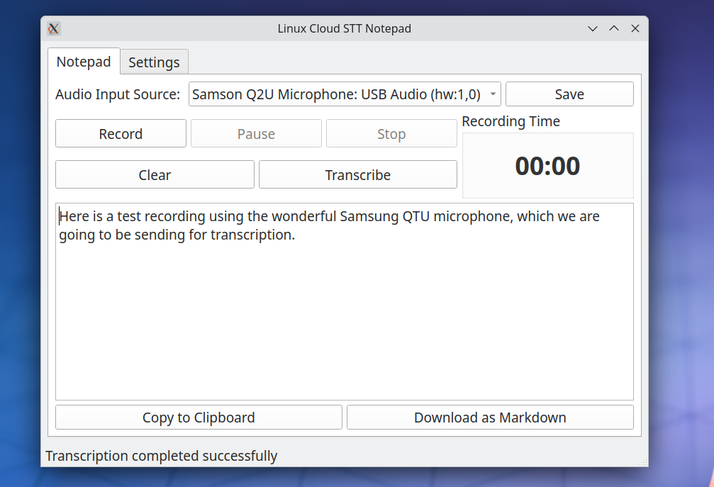
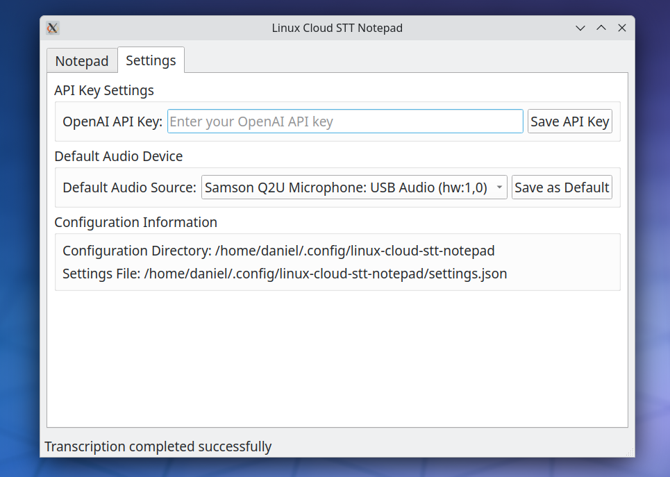

# Linux-Cloud-STT-Notepad

 

A minimalist notepad application for Linux with speech-to-text capabilities using the OpenAI API.

## Features

- Record audio from any input device
- Transcribe speech to text using OpenAI's Whisper model
- Edit transcribed text
- Copy text to clipboard
- Save transcriptions as Markdown files
- Persistent settings between sessions

## Requirements

- Python 3.6+
- PyQt5
- sounddevice
- numpy
- scipy
- requests
- python-dotenv
- openai

## Screenshots

 






## Installation

1. Clone this repository:
   ```
   git clone https://github.com/danielrosehill/Linux-Cloud-STT-Notepad.git
   cd Linux-Cloud-STT-Notepad
   ```

2. Install dependencies:
   ```
   pip install -r requirements.txt
   ```

3. Create a `.env` file with your OpenAI API key:
   ```
   OPENAI_API_KEY="your_openai_api_key_here"
   ```
   Note: An example file `.env.example` is provided for reference.

## Usage

1. Run the application:
   ```
   python app.py
   ```

2. Select your audio input device from the dropdown and click "Save"

3. Use the recording controls:
   - **Record**: Start recording audio
   - **Pause/Resume**: Temporarily pause or resume recording
   - **Stop**: End recording and save to a temporary file
   - **Clear**: Discard the current recording
   - **Transcribe**: Send the recorded audio to OpenAI API for transcription

4. Once transcription is complete, you can:
   - Edit the text in the main text area
   - Copy the text to clipboard
   - Download the text as a Markdown file

## Configuration

The application stores your settings in `~/.config/linux-cloud-stt-notepad/settings.json`.

## License

[MIT License](LICENSE)

## Credits

- Speech-to-text powered by [OpenAI's Whisper model](https://platform.openai.com/docs/guides/speech-to-text)
- Built with PyQt5
